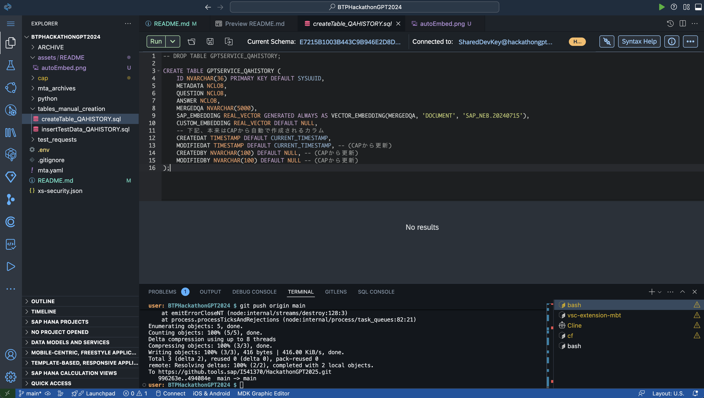
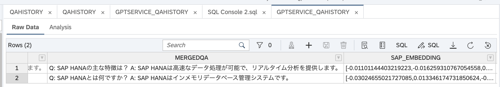

# AI Agent App Sample - In-database Vectorization 検証

本アプリケーションでは、In-database Vectorization の機能を検証しつつ、**AI Agent App Sample** の構成を行います。

## In-database Vectorization について

以下のようにテーブルを作成することで、`PARAGRAPH` カラムに挿入されたデータが、自動的に `SAP_NEB.20240715` によりベクトル化され、`EMBEDDING` カラムに挿入されます。

例）

```sql
CREATE TABLE MY_EMBEDDINGS(
    TITLE NVARCHAR(100),
    PARAGRAPH_ID INT,
    PARAGRAPH NVARCHAR(5000),
    EMBEDDING REAL_VECTOR GENERATED ALWAYS AS
    VECTOR_EMBEDDING(PARAGRAPH, 'DOCUMENT', 'SAP_NEB.20240715')
);
```

[VECTOR_EMBEDDING Function (Vector)](https://help.sap.com/docs/hana-cloud-database/sap-hana-cloud-sap-hana-database-vector-engine-guide/vector-embedding-function-vector)

しかし、SAP CAP のスキーマ定義から MTA の仕組みを用いて動的にこのテーブルを HANA Cloud にデプロイすることは現状ではできません。
そのため、以下の手順で回避を試みます。

## セットアップ手順

まず、04_aiAgentAppに移動

```bash
cd 04_aiAgentApp/
mbt build
cf deploy mta_archives/aiagentsample_1.0.0.mtar
```

1. AI Core / Cloud Logging のサービスインスタンスをデプロイ対象のスペースに立ち上げる
    - `default_aicore`（サービスキーを作成）（ブースターで立ち上げていれば不要）
    - `default_logging`
    - `aiagentsample-db`（SharedDevKey を追加）

2. 手動でテーブルを作成する
    - `tables_manual_creation/createTable_QAHISTORY.sql` を使用し、HANA SQL コンソール？を起動
    - `aiagentsample-db(prod)` に接続
        - 表示されない場合には、Build Code画面の左下の`SAP HANA PROJECTS` よりデザインタイムバインドを実行
        - ログインできない場合は、`Connect with Different User` でサービスキーの `hdi_user / hdi_password` を使用して接続
    - SQLを実行する



3. サンプルデータをSQLから追加する
    - `tables_manual_creation/insertTestData_QAHISTORY.sql` を使用し、HANA SQL コンソール？を起動
    - SQLを実行する
    - 適宜、SAP HANA Cloud Database Explorerからデータを確認する

4. アプリケーションのデプロイ
    ```sh
    mbt build 
    cf deploy mta_archives/aiagentsample_1.0.0.mtar
    ```

5. Destinationを追加する
    - mtaで紐づいたdestinationインスタンス or サブアカウントに対して、`AICore_AI_API`という名前で、SAP AI CoreのOAuth認証に対応した宛先を作成する。（cap-llm-plugin 用）
    - この際、AI CoreのXSUAAのシークレットは、CAP側にバインドされたシークレットキーである必要がある。デプロイのたびにopenai-aicore-apiデスティネーションのclient_secretは修正が必要。
    ```bash
    node manualTasks/01_setup_AICore_AI_API_destination/setup-aicore-destination.js
    ```


5. テストリクエストを送信する
    - `test_requests/cap/test_basic.http` を使用して `GET/POST` リクエストを試行
    - 既存の`package.json`ではなく、`package_xsuaa.json`を`package.json`に名称変更してデプロイした場合には、XSUAAにより保護されるので、`test_requests/test_xsuaa.http` を使用する。cliend_secretは毎回変わるのでBTP Cockpitとかからコピーしてくる。
    - 返り値のイメージは下記のとおり。

```

```

```http
HTTP/1.1 200 OK
content-length: 1048
content-type: application/json; charset=utf-8
date: Wed, 19 Mar 2025 07:43:00 GMT
odata-version: 4.0
x-correlation-id: 02a7dbc0-dad3-49dd-503a-6b409557f52b
x-powered-by: Express
x-vcap-request-id: 02a7dbc0-dad3-49dd-503a-6b409557f52b
strict-transport-security: max-age=31536000; includeSubDomains; preload;
connection: close

{
  "@odata.context": "$metadata#Qahistory",
  "value": [
    {
      "ID": "7B8A001004A6CC5A1900AE3E2486A868",
      "answer": "SAP HANAは高速なデータ処理が可能で、リアルタイム分析を提供します。",
      "createdAt": "2025-03-19T06:08:42.050Z",
      "createdBy": null,
      "mergedqa": "Q: SAP HANAの主な特徴は？ A: SAP HANAは高速なデータ処理が可能で、リアルタイム分析を提供します。",
      "metadata": "{\"source\": \"UserQuery\", \"created_by\": \"user123\"}",
      "modifiedAt": "2025-03-19T06:08:42.050Z",
      "modifiedBy": null,
      "question": "SAP HANAの主な特徴は？"
    }
  ]
}
```

```http
HTTP/1.1 201 Created
content-length: 523
content-type: application/json; charset=utf-8
date: Wed, 19 Mar 2025 07:42:10 GMT
location: Qahistory(85eb829d-6dd0-4c72-bdbb-1e0e55b618d9)
odata-version: 4.0
x-correlation-id: 20348f64-7dc5-41b5-4754-e761b3b97d7f
x-powered-by: Express
x-vcap-request-id: 20348f64-7dc5-41b5-4754-e761b3b97d7f
strict-transport-security: max-age=31536000; includeSubDomains; preload;
connection: close

{
  "@odata.context": "$metadata#Qahistory/$entity",
  "ID": "85eb829d-6dd0-4c72-bdbb-1e0e55b618d9",
  "answer": "SAP HANAはインメモリデータベース管理システムです。",
  "createdAt": "2025-03-19T07:42:08.566Z",
  "createdBy": "system",
  "mergedqa": "Q: SAP HANAとは何ですか？ A: SAP HANAはインメモリデータベース管理システムです。",
  "metadata": "{\"source\": \"FAQ\", \"created_by\": \"admin\"}",
  "modifiedAt": "2025-03-19T07:42:08.566Z",
  "modifiedBy": "system",
  "question": "SAP HANAとは何ですか？"
}
```

結果は下記の通りで、自動的にEmbeddingが実行される



---

この README は、In-database Vectorization を活用した **AI Agent App Sample** のセットアップ手順を記述したものです。適宜更新しながら運用してください。
