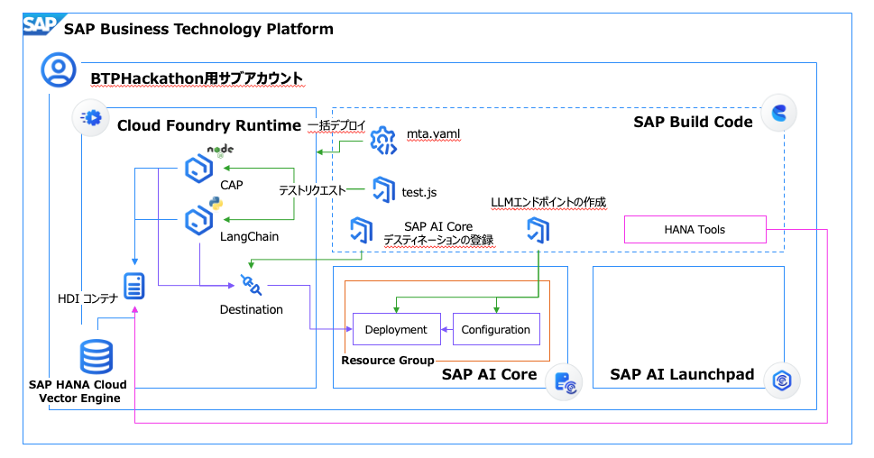
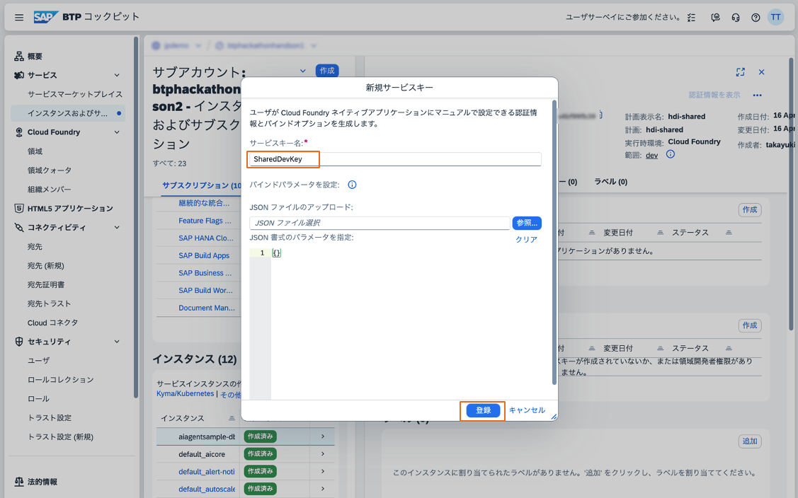
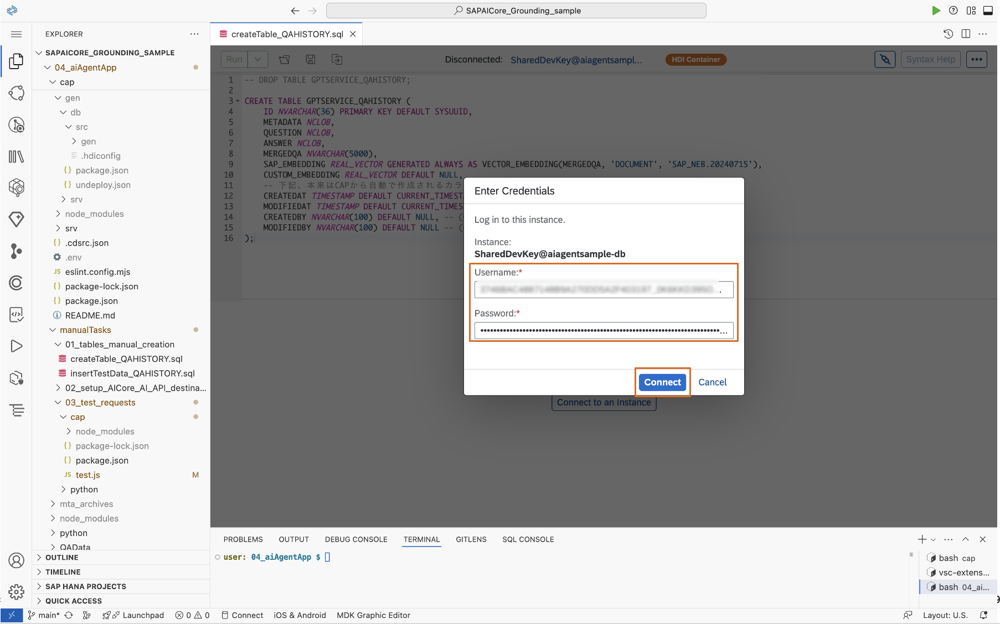
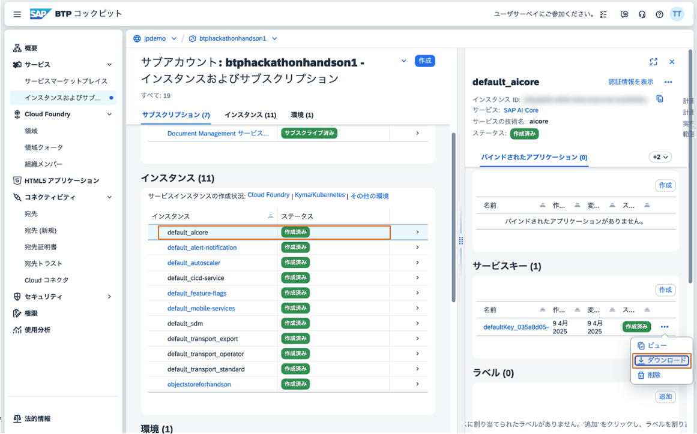

# AI Agent アプリケーション on SAP BTP (SAP Embedding版) ハンズオン実施手順

## 概要
この手順書では、SAP HANA Cloud, Vector Engine に追加されたIn-Database Vectorizationと、SAP AI Core - Generative AI HubによるSAPのLLMパートナー企業から提供されるEmbeddingモデルを併用した、LangChainフレームワークによるAI Agentアプリケーションを構築します。

### アーキテクチャイメージ



## 1. HANA Cloud セットアップ

### 1.1 HANA Cloud Booster の実行
1. SAP BTP コックピットにログインし、HANA Cloud Booster を検索します
   

2. "HANA Cloud のセットアップ" シナリオを選択します
   

3. サブアカウントを選択します
   

4. ユーザーを指定します
   

### 1.2 HANA Cloud インスタンスの作成
1. HANA Cockpit を起動します
   

2. Cloud Foundry にログインします
   

3. スペースを選択します
   

4. 以下の設定で HANA Cloud インスタンスを作成します：
   - 一般設定
     
   - スペック設定
     
   - アベイラビリティーゾーンの選択
     
   - NLP 機能の有効化
     
   - インスタンスマッピングの設定
     

5. インスタンス作成を実行します
   
   

### 1.3 HDI コンテナの設定
1. グローバルアカウントからサブアカウントへのEntitlement付与を行います：
   - SAP BTP コックピットでグローバルアカウントにログインします
   - "権限 -> エンティティ割り当て" セクションに移動し、サブアカウントを選択します
   - "編集" をクリックします
   - "サービスプランを追加" を選択します
   - 以下のサービスプランを追加します：
     - SAP HANA Schemas & HDI Containers
   - 変更を保存します
   - 変更が保存されるまで待機します
   
   
   

2. HDI コンテナを作成します
   
   - **この際、「aiagentsample-deepdiveXXX-db」という名前に対して、自分のIDをXXXに代入した値を入力してください。**
   
   <!--  -->

<!-- 3. サービスキーを作成します
   
    -->

## 2. アプリケーションのデプロイ

### 2.1 デプロイ前の準備
1. ワークスペースを作成します：
   - "Create Workspace" をクリックします
     
   - "App Development" を選択します
     
   - "Build Code" を選択します
     
   - "Full Stack" を選択します
     
   - 詳細情報を入力します
     
   - "Get Started" をクリックします
     
   - Gitからクローンします
     
   - プロジェクトがクローンされたことを確認します
     
   
   - 自分のIDに合わせてファイル内のdeepdiveXXXを置き換えます：
     - 検索機能を開きます
       
     - mta.yamlをはじめとする諸ファイル内のdeepdiveXXXを自分のIDで置き換えます
       
       
   - ターミナルを開き、プロジェクトディレクトリに移動します
     

2. DevSpaceにHANA Toolsを追加します：
   - DevSpace Managerを開きます
     
   - 実行中のDevSpaceを停止します
     
   - Settingsを開きます
     
   - HANA Toolsを選択します
     
   - DevSpaceを再起動します
     
   - 実行状態を確認します
     

3. SAP Cloud Loggingのインスタンスを作成します：
   - SAP BTP コックピットでインスタンス作成画面を開きます
   - インスタンス名を入力します
     
   - インスタンスを作成します
     
   - インスタンスが作成されたことを確認します
     

4. Cloud Foundry にログインします
   

5. API エンドポイントを取得します
   

### 2.2 アプリケーションのビルドとデプロイ
1. アプリケーションをビルドし、デプロイします
   

## 3. 手動タスクの実行

### 3.1 テーブルの作成とテストデータの投入
1. HANA Cockpit にログインし、SQLコンソールを開きます
2. HDIコンテナに接続します：
   - Command Paletteを開きます
     
   - HDIコンテナを選択します
     
   - HDIコンテナが接続されたことを確認します
     
   - SQLファイルを開きます
     
   - 対象のHDIコンテナを選択します
     
   - 認証情報を取得します
     
   - 認証情報を入力します
     
   - DBへの接続が成功したことを確認します
     

3. テーブルを作成します：
   - テーブル作成SQLを実行します
     
   - テーブルが作成されたことを確認します

4. サンプルデータを投入します：
   - サンプルデータ投入SQLを実行します
     
   - データが投入されたことを確認します

### 3.1.5 SAP HANA Database Explorerでデータを確認します
   - SAP HANA Centralを開きます
     
   - Database Explorerを開きます
     
   - ログインします
     
   - HDIコンテナを追加します
     
   - サービスキーを取得します
     
   - サービスキーを設定します
     
   - データを開きます
     
   - サンプルデータを表示します
     

6. 必要に応じてテーブルを削除します：
   - テーブル削除SQLを実行します
     
   - テーブルが削除されたことを確認します

### 3.2 AI Core と AI API のデスティネーション設定
1. Node.js がインストールされていることを確認します
2. 以下のコマンドを実行してデスティネーションを設定します：
   ```bash
   cd manualTasks
   npm install
   node 02_setup_AICore_AI_API_destination/setup-aicore-destination.js
   ```

3. AI CoreインスタンスをCAPアプリケーションにバインドします：
   - Command Paletteを開き、「>bind」と入力してローカルバインドを実行するを選択し、バインド先のディレクトリを選択します。capのディレクトリを選択します。
     
   - `default_aicore`のインスタンスを選択します
     
   - SAP AI Coreインスタンスの環境情報が作成されたことを確認します
     
  - **同様の操作を、pythonのディレクトリに対しても行いましょう。これにより、後続のテストリクエストを処理できるようになります。**


4. LLMデプロイメントを作成します：
   ```bash
   # リソースグループを作成
   node 03_createLLMDeployments/01_init.js
   🔧 モード選択: 1) ResourceGroup作成, 2) モデルデプロイ, 3) 状態確認 [1/2/3]: 1
   ```
   リソースグループが作成されたことを確認します：
   

   ```bash
   # デプロイメントを作成
   node 03_createLLMDeployments/01_init.js
   🔧 モード選択: 1) ResourceGroup作成, 2) モデルデプロイ, 3) 状態確認 [1/2/3]: 2
   ```
   - 2本のモデル（チャットモデル+エンべディングモデル）をデプロイメントとして追加しますが、かなり時間がかかります(10分 x 2 程度)。途中でスクリプトによる監視が途切れた時は、同じスクリプトを再度実行し、`2)モデルデプロイ`にて再度監視を開始してください。
   

5. SAP CAPの環境変数に、デプロイが完了したモデルのIDを上書きします。
    ```bash
    node 03_createLLMDeployments/02_migrateDeploymentId.js
    ```
    - 完了すると、`cap/.cdsrc.json`にデプロイメントのIDが指定され、LLMモデルにCAPからアクセスできるようになります。
    

6. SAP CAPを再デプロイします。
    ```bash
    cd ../
    mbt build
    cf deploy mta_archives/<プロジェクト名>.mtar
    ```
    - これにより、上記の環境変数が反映されます。
    

5. SAP AI LaunchpadとSAP AI Coreのインスタンスを紐付けます：
   - SAP AI Launchpadにログインします
        - **この際、Default Identity Providerでログインしてください。カスタムIASで認証が走ってしまっている場合は、シークレットモードでSAP AI Launchpadのリンクを開いてください。**
   - インスタンスの紐付け画面を開きます
     
   - SAP AI Coreのインスタンスを選択します
     
   - 紐付けが完了したことを確認します
     
   - 上記作業で作成されたConfigurationやDeploymentsの確認が可能です。


### 3.3 テストリクエストの実行

#### CAPアプリケーション用のテストリクエスト
1. Node.js がインストールされていることを確認します
2. GET用のテストスクリプトを実行します：
    ```bash
    node 03_test_requests/cap/test.js
    どの操作を実行しますか？（get / post）: get
    ```
   
3. GETリクエストのテスト結果を確認します：
   

4. POST用のテストスクリプトを実行します：
    ```bash
    node 03_test_requests/cap/test.js
    どの操作を実行しますか？（get / post）: post
    ```
   
5. POSTリクエストのテスト結果を確認します：
  - POSTリクエストにより、SAP CAPを介してDBにデータを登録します。カスタムハンドラを用いて、格納後にカスタムのEmbeddingを特定のカラムに格納しています。
  

6. SAP HANA Database Explorerより挿入されたデータを確認する
  - SAP HANA Database Explorerへのアクセスは[こちら](#315-sap-hana-database-explorerでデータを確認します)をご参照ください。
  - CUSTOM_EMBEDDINGカラムに、SAP AI Coreにデプロイしてカスタムで作成したベクトル表現が格納されます。
  
  

#### Pythonモジュール用のテストリクエスト
1. Node.js がインストールされていることを確認します
2. テストスクリプトを実行します：
   ```bash
   node 03_test_requests/python/test.js
   ```
   どのエンドポイントを呼び出しますか？（chat / chain）: chain

3.`/chain`エンドポイントに対するリクエストのテスト結果を確認します：
   

4. ログの確認
  - `cf apps` にて、デプロイされたアプリケーション一覧を表示し、ai-agentアプリの名前をコピーする
  - `cf logs <アプリケーション名>` により、ログをストリーミングする
  - この状態で上記のテストリクエストを送付すると、下記の通りログを確認できる。
  - SAP HANA Cloud からRAGツールを用いて関連するデータを取得し、それに基づいて回答を生成していることが確認できる。
   
   

## 注意事項
- セットアップには SAP BTP の適切な権限が必要です
- リソースの作成には時間がかかる場合があります
- 各ステップで問題が発生した場合は、画像を参照して設定を確認してください
- 手動タスクの実行前に、必要なツール（Node.js）がインストールされていることを確認してください
- SQLファイルの実行時は、適切なデータベース接続情報を指定してください
- テストリクエストは、Pythonモジュール用またはCAPアプリケーション用のいずれかの方法で実行できます
