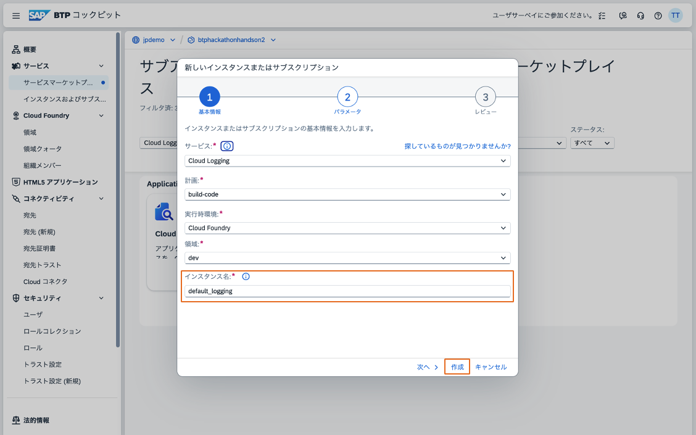

# SAP AI Core Grounding サンプルアプリケーション セットアップ手順

## 1. HANA Cloud セットアップ

### 1.1 HANA Cloud Booster の実行
1. SAP BTP コックピットにログインし、HANA Cloud Booster を検索します
   

2. "HANA Cloud のセットアップ" シナリオを選択します
   

3. サブアカウントを選択します
   

4. ユーザーを指定します
   

### 1.2 HANA Cloud インスタンスの作成
1. HANA Cockpit を起動します
   

2. Cloud Foundry にログインします
   

3. スペースを選択します
   

4. 以下の設定で HANA Cloud インスタンスを作成します：
   - 一般設定
     
   - スペック設定
     
   - アベイラビリティーゾーンの選択
     
   - NLP 機能の有効化
     
   - インスタンスマッピングの設定
     

5. インスタンス作成を実行します
   
   

### 1.3 HDI コンテナの設定
1. グローバルアカウントからサブアカウントへのEntitlement付与を行います：
   - SAP BTP コックピットでグローバルアカウントにログインします
   - サブアカウントを選択します
   - "Entitlements" セクションに移動します
   - "Configure Entitlements" をクリックします
   - "Add Service Plans" を選択します
   - 以下のサービスプランを追加します：
     - SAP HANA Cloud
     - SAP HANA Schemas & HDI Containers
   - 変更を保存します
   
   
   

2. HDI コンテナを作成します
   
   
   

3. サービスキーを作成します
   
   

## 2. アプリケーションのデプロイ

### 2.1 デプロイ前の準備
1. ワークスペースを作成します：
   - "Create Workspace" をクリックします
     
   - "App Development" を選択します
     
   - "Build Code" を選択します
     
   - "Full Stack" を選択します
     
   - 詳細情報を入力します
     
   - "Get Started" をクリックします
     
   - Gitからクローンします
     
   - プロジェクトがクローンされたことを確認します
     
   - ターミナルを開き、プロジェクトディレクトリに移動します
     

2. DevSpaceにHANA Toolsを追加します：
   - DevSpace Managerを開きます
     
   - 実行中のDevSpaceを停止します
     
   - Settingsを開きます
     
   - HANA Toolsを選択します
     
   - DevSpaceを再起動します
     
   - 実行状態を確認します
     

3. SAP Cloud Loggingのインスタンスを作成します：
   - SAP BTP コックピットでインスタンス作成画面を開きます
   - インスタンス名を入力します
     
   - インスタンスを作成します
     
   - インスタンスが作成されたことを確認します
     

4. Cloud Foundry にログインします
   

5. API エンドポイントを取得します
   

### 2.2 アプリケーションのビルドとデプロイ
1. アプリケーションをビルドし、デプロイします
   

## 3. 手動タスクの実行

### 3.1 テーブルの作成とテストデータの投入
1. HANA Cockpit にログインし、SQLコンソールを開きます
2. HDIコンテナに接続します：
   - Command Paletteを開きます
     
   - HDIコンテナを選択します
     
   - HDIコンテナが接続されたことを確認します
     
   - SQLファイルを開きます
     
   - 対象のHDIコンテナを選択します
     
   - 認証情報を取得します
     
   - 認証情報を入力します
     
   - DBへの接続が成功したことを確認します
     

3. テーブルを作成します：
   - テーブル作成SQLを実行します
     
   - テーブルが作成されたことを確認します

4. サンプルデータを投入します：
   - サンプルデータ投入SQLを実行します
     
   - データが投入されたことを確認します

5. 必要に応じてテーブルを削除します：
   - テーブル削除SQLを実行します
     
   - テーブルが削除されたことを確認します

### 3.2 AI Core と AI API のデスティネーション設定
1. Node.js がインストールされていることを確認します
2. 以下のコマンドを実行してデスティネーションを設定します：
   ```bash
   cd manualTasks/02_setup_AICore_AI_API_destination
   npm install
   node setup-aicore-destination.js
   ```

### 3.3 テストリクエストの実行

#### Pythonモジュール用のテストリクエスト
1. Node.js がインストールされていることを確認します
2. テストスクリプトのディレクトリに移動します：
   ```bash
   cd manualTasks/03_test_requests/python
   ```
3. 必要なパッケージをインストールします：
   ```bash
   npm install
   ```
4. Destinationインスタンスをバインドします：
   - Destination Selectorを開きます
     
   - ディレクトリを選択します
     
   - インスタンスを選択します
     
   - 環境が作成されたことを確認します
     
5. テストスクリプトを実行します：
   ```bash
   node test.js
   ```

#### CAPアプリケーション用のテストリクエスト
1. Node.js がインストールされていることを確認します
2. テストスクリプトのディレクトリに移動します：
   ```bash
   cd manualTasks/03_test_requests/cap
   ```
3. 必要なパッケージをインストールします：
   ```bash
   npm install
   ```
4. Destinationインスタンスをバインドします：
   - Destination Selectorを開きます
     
   - ディレクトリを選択します
     
   - インスタンスを選択します
     
   - 環境が作成されたことを確認します
     
5. テストスクリプトを実行します：
   ```bash
   node test.js
   どの操作を実行しますか？（get / post）: get
   ```
6. GETリクエストのテスト結果を確認します：
   

## 注意事項
- セットアップには SAP BTP の適切な権限が必要です
- リソースの作成には時間がかかる場合があります
- 各ステップで問題が発生した場合は、画像を参照して設定を確認してください
- 手動タスクの実行前に、必要なツール（Node.js）がインストールされていることを確認してください
- SQLファイルの実行時は、適切なデータベース接続情報を指定してください
- テストリクエストは、Pythonモジュール用またはCAPアプリケーション用のいずれかの方法で実行できます
