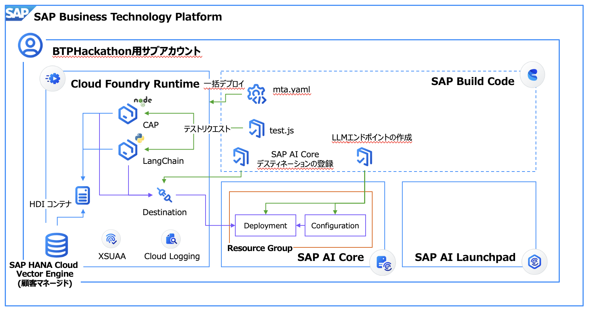

# AI Agent ハンズオン手順書

## 目次
- [デモ動画](#デモ動画)
- [概要](#概要)
- [CAP（知識DBへのデータの出し入れを担当）](#cap知識dbへのデータの出し入れを担当)
  - [1. アプリをデプロイする](#1-アプリをデプロイする)
  - [2. GETリクエストをテストする](#2-getリクエストをテストする)
  - [3. LLM のAPIをセットアップする](#3-llm-のapiをセットアップする)
  - [4. CAPの環境変数（.cdsrc.json）にLLM APIのIDを転記する](#4-capの環境変数cdsrcjsonにllm-apiのidを転記する)
  - [5. 新しい環境変数で再デプロイする](#5-新しい環境変数で再デプロイする)
  - [6. 動作を確認する](#6-動作を確認する)
- [Python（LangChainフレームワークを用いた AI Agent）](#pythonlangchainフレームワークを用いた-ai-agent)
  - [7. テスト環境の準備と実行](#7-テスト環境の準備と実行)
- [まとめ](#まとめ)

## デモ動画
以下のYouTubeリンクでAI Agentのデモをご覧いただけます：

[](https://youtu.be/U7Z9AH0B458)

このハンズオンでは、SAP BTPでAI Agentをホストする方法を学びます。CAP（Cloud Application Programming）アプリケーションとPythonベースのLangChainフレームワークを組み合わせて、知識DBとAI Agentを構築します。

## 概要
このAI Agentアプリケーションは、SAP BTP上でアプリケーションを開発する際に利用するMulti Target Application(MTA)というフレームワークに基づいて構成されている。
このMTAは、マイクロサービスを利用してアプリケーションを構成し、いくつかのサービスをまとめて一つのアプリケーションとして管理できる仕組みである。



例えば、今回の場合は`mta.yaml`というファイルに構成情報が記載されており、主要な部分を抜粋すると、下記のようになる。

```yaml
    # メタデータ。
    _schema-version: 3.3.0
    ID: aiagentsample-simple-deepdiveXXX # アプリケーションのID。この粒度でアプリケーションをまるっと管理することができる。
    version: 1.0.0
    description: "CAP and python."
    ...
    build-parameters:
    before-all:
    # デプロイ前に実行するビルド方法をカスタムで指定する
    - builder: custom
        # ビルド時に、下記のコマンドを実行する
        commands:
        - npm install --prefix cap # capディレクトリ配下で、npm install を実行し、CAPモジュールの依存関係をインストールする
        - cds build --project cap # capディレクトリ配下で、cds build コマンドを実行し、プロジェクトをデプロイするためのオブジェクトを生成する

    # アプリケーションを構成するモジュール群の宣言。
    # アプリ本体や、認証用のインスタンス、AI Coreインスタンスなどを定義する。
    modules:
    # モジュール (1): AI Agent (LangChain) を実行するPythonモジュール。
    # Flask (Webサーバー用のフレームワーク) の中に、LangChain (AI Agent用のフレームワーク) を構成している。
    - name: aiagentsample-simple-deepdiveXXX-ai-agent-srv
        type: python
        # モジュールのソースコードがどこにあるかを宣言。
        # mta.yamlから見て、pythonディレクトリの中にソースコードがあるので、その相対パスを指定
        path: python
        ...
        buildpack: python_buildpack # Python のアプリケーションであること（Pythonのランタイムを利用したいこと）を宣言
        ...
        provides:
        - name: agent-srv-api # このアプリケーションのホスティングURLをagent-srv-apiとしてexposeし、このmta.yamlの中で利用できるようにすることを宣言
            properties:
            srv-url: ${default-url}
        
        # 各種のモジュール(依存関係)をバインド = このモジュールの立ち上げにこれらのサービスを必須とすることを宣言
        requires:
        - name: aiagentsample-simple-deepdiveXXX-db # DB (SAP HANA Cloud) のインスタンス
        - name: aiagentsample-simple-deepdiveXXX-destination # Destination (外部システムへの宛先管理サービス)のインスタンス
        - name: aiagentsample-simple-deepdiveXXX-auth # XSUAA (認証認可サービス) のインスタンス
        - name: default_aicore # SAP AI Core のインスタンス
        - name: default_logging # SAP Cloud Logging のインスタンス

    # モジュール (2): CAP を実行するNode.jsモジュール。
    # Node.js の CAP を実行し、SAP HANA Cloudに対してデータのCRUD処理を行うバックエンドサービスとして機能する。
    - name: aiagentsample-simple-deepdiveXXX-cap-srv
        type: nodejs
        # モジュールのソースコードがどこにあるかを宣言。
        # CAPでは、デプロイ前に cds build というコマンドでランタイムオブジェクトを作成するが、それがcap/genに生成される。
        path: cap/gen/srv 
        ...
        parameters:
        instances: 1
        buildpack: nodejs_buildpack # Node.js のアプリケーションであること（Node.jsのランタイムを利用したいこと）を宣言
        ...
        provides:
        - name: srv-api # このアプリケーションのホスティングURLを srv-api としてexposeし、このmta.yamlの中で利用できるようにすることを宣言
            properties:
            srv-url: ${default-url}
        # 各種のモジュール(依存関係)をバインド = このモジュールの立ち上げにこれらのサービスを必須とすることを宣言
        requires:
        - name: aiagentsample-simple-deepdiveXXX-db # DB (SAP HANA Cloud) のインスタンス
        - name: aiagentsample-simple-deepdiveXXX-destination # Destination (外部システムへの宛先管理サービス)のインスタンス
        - name: aiagentsample-simple-deepdiveXXX-auth # XSUAA (認証認可サービス) のインスタンス
        - name: default_aicore # SAP AI Core のインスタンス
        - name: default_logging # SAP Cloud Logging のインスタンス

    # モジュール (3): db-deployer: DB に対してテーブルの作成や初期データのロードをさせるためのモジュール。デプロイ時に一時的に起動し、デプロイ完了後には自動的に停止する。
    # Node.js の CAP を実行し、SAP HANA Cloudに対してデータのCRUD処理を行うバックエンドサービスとして機能する。
    - name: aiagentsample-simple-deepdiveXXX-db-deployer
        type: hdb
        ...
        buildpack: nodejs_buildpack # Node.js のアプリケーションであること（Node.jsのランタイムを利用したいこと）を宣言
        # DB をバインド = このモジュールの立ち上げにこれらのサービスを必須とすることを宣言
        requires:
        - name: aiagentsample-simple-deepdiveXXX-db  # DB (SAP HANA Cloud) のインスタンス

    # アプリケーションで利用するリソース（マイクロサービス）の宣言。
    # 認証認可やDB、AI Core、ロギングなどのコンポーネントを定義する。ここで定義することで、上記のモジュールの中で、依存関係として利用できるようになる。
    resources:
    ## リソース (1): SAP HANA Cloud HDIコンテナ のインスタンス
    - name: aiagentsample-simple-deepdiveXXX-db
        type: com.sap.xs.hdi-container
        parameters:
        service: hana
        service-plan: hdi-shared
    ## リソース (2): Destination のインスタンス
    - name: aiagentsample-simple-deepdiveXXX-destination
        # managed-service により、デプロイ時にアプリケーションと紐づいた形で自動的にモジュールを管理することを宣言。
        type: org.cloudfoundry.managed-service
        parameters:
        config:
            ...
            # Destinationインスタンスに自動的に登録するDestinationの一覧
            init_data:
            instance:
                destinations:
                # CAP に対する宛先を登録
                - Authentication: BasicAuthentication # CAPにはBasic認証をかけているので、認証タイプを宣言
                  User: deepdiveXXX  # Basic認証のユーザー名
                  Password: deepdiveXXX  # Basic認証のパスワード
                  HTML5.DynamicDestination: true
                  Name: aiagentsample-simple-deepdiveXXX-cap-srv # 宛先の名前。CAPモジュールであることがわかるように。
                  ProxyType: Internet
                  Type: HTTP
                  URL: ~{srv-api/srv-url} # srv-api はCAPモジュールで定義したURL。そこをポイントして宛先にすることを宣言。
                ...
        service: destination
        ...
        requires:
        - name: srv-api
        - name: agent-srv-api
    ## リソース (3): XSUAA のインスタンス
    - name: aiagentsample-simple-deepdiveXXX-auth
        # managed-service により、デプロイ時にアプリケーションと紐づいた形で自動的にモジュールを管理することを宣言。
        type: org.cloudfoundry.managed-service
        parameters:
        service: xsuaa
        ...
    ## リソース (4): SAP AI Core のインスタンス
    - name: default_aicore
        # existing-service により、アプリケーションとは分離された状態で、元から環境にあるインスタンスを利用することを宣言。
        type: org.cloudfoundry.existing-service
    ## リソース (5): SAP Cloud Logging のインスタンス
    - name: default_logging
        # existing-service により、アプリケーションとは分離された状態で、元から環境にあるインスタンスを利用することを宣言。
        type: org.cloudfoundry.existing-service
```

## CAP（知識DBへのデータの出し入れを担当）

### 1. アプリをデプロイする

1. ターミナルを開き、aiAgentApp_simpleディレクトリに移動
   ```
   cd 05_aiAgentApp_simple
   ```

2. MTAビルドを実行
   ```
   mbt build
   ```
   - MTAとは「Multi Target Application」の略で、複数のモジュール（今回はCAPとPython）を一つのアプリケーションとしてデプロイするための仕組みです。

3. Cloud Foundryにログイン
   ```
   cf login -a <API URL>
   ```
   - ログイン情報は SAP Universal IDのメールアドレスとパスワードを入力
   - 注意：入力するのはSユーザーIDではなく、SAP Universal IDのメールアドレス

4. デプロイ実行
   ```
   cf deploy mta_archives/<mtarファイルの名前>
   ```
   - デプロイが完了すると、CAPサービスとAI Agent（Python）サービスの両方がBTP上にホストされます。

5. デプロイ確認
   - BTP Cockpitからデプロイが完了したことを確認
   - 発行されたURLとサービスのバインドを確認

### 2. GETリクエストをテストする

1. ローカルアプリケーションへのサービスバインド
   - "Bind a service to a locally run application"オプションから、`05_aiAgentApp_simple/cap`に対して、`default_aicore`をバインド
   - 同様に、`05_aiAgentApp_simple/cap`に対して、`aiagentsample-simple-deepdiveXXX-destination`をバインド
   - `cap`ディレクトリ配下の`.env`ファイルに認証情報が書き込まれたことを確認
   - この手順により、ローカル開発環境からBTP上のサービスに接続するための認証情報が設定されます。

2. テストを実行
   ```
   cd manualTasks
   npm install
   node 04_test_requests/cap/test.js
   ```
   - リクエストの内容を問う内容が表示されたら「get」と入力
   - 正常に空のデータが返ってくることを確認（初期状態ではデータがないため）
   - このテストでは `executeHttpRequest` を使用してCAPサービスのODataエンドポイントにGETリクエストを送信しています
   ```js
   const response = await executeHttpRequest(capDestination, {
       method: 'GET',
       url: '/odata/v4/GPT/QahistoryView'
   });
   ```
   - 時間があれば、postリクエストを送ると、まだEmbeddingモデルがホストされていないため成功しないことを確認できる。

### 3. LLM のAPIをセットアップする

1. AI Core用のデスティネーションをセットアップ
   ```
   node 02_setup_AICore_AI_API_destination/setup-aicore-destination.js
   ```
   - バインドされたdestinationの管理画面から、AICore_AI_APIのデスティネーションが追加されたことを確認
   - このステップで、AI Coreの機能にアクセスするためのデスティネーション（接続情報）が設定されます。

2. LLMデプロイメントを作成
   ```
   node 03_createLLMDeployments/01_init.js
   ```
   - プロンプトが表示されたら、メニューから「2」を選択（Embedding + Chatモデル）
   - このスクリプトではまず、LLMモデルをデプロイするためのConfiguration（構成）を作成します：([05_aiAgentApp_simple/manualTasks/03_createLLMDeployments/01_init.js](../../05_aiAgentApp_simple/manualTasks/03_createLLMDeployments/01_init.js))
   ```js
   // Configurationの作成
   async function createConfiguration(token, modelName, modelVersion, modelType) {
     const url = `${AI_API_HOST}/v2/lm/configurations`;
     const payload = {
       name: `${modelName}-configuration`,
       executableId: 'azure-openai',
       scenarioId: 'foundation-models',
       parameterBindings: [
         { key: "modelName", value: modelName }, 
         { key: "modelVersion", value: "latest" }
       ],
       artifacts: { 
         model: { 
           artifactName: `${modelName}-model`, 
           version: modelVersion 
         } 
       },
       environment: { variables: {} }
     };
     
     const res = await axios.post(url, payload, {
       headers: {
         Authorization: `Bearer ${token}`,
         'Content-Type': 'application/json',
         'AI-Resource-Group': resourceGroupId
       }
     });
     
     // 作成したConfigurationのIDを保存
     userCreds[`${modelType}Model_configurationId`] = res.data.id;
     fs.writeFileSync(userCredsPath, JSON.stringify(userCreds, null, 2));
     console.log('✅ Configuration created:', res.data.id);
     return res.data.id;
   }
   ```
   
   - 次に、作成したConfigurationを使用してデプロイメントを作成します：([05_aiAgentApp_simple/manualTasks/03_createLLMDeployments/01_init.js](../../05_aiAgentApp_simple/manualTasks/03_createLLMDeployments/01_init.js))
   ```js
   // Deploymentの作成
   async function createDeployment(token, configurationId) {
     const url = `${AI_API_HOST}/v2/lm/deployments`;
     const payload = {
       configurationId
     };

     const res = await axios.post(url, payload, {
       headers: {
         Authorization: `Bearer ${token}`,
         'ai-resource-group': resourceGroupId,
         'Content-Type': 'application/json'
       }
     });

     const deploymentId = res.data.id;
     console.log("🚀 Deployment スケジュール完了:", deploymentId);

     // orchDeploymentId を保存
     const currentVars = JSON.parse(fs.readFileSync(userDefinedPath, 'utf8'));
     currentVars.orchDeploymentId = deploymentId;
     fs.writeFileSync(userDefinedPath, JSON.stringify(currentVars, null, 2), 'utf8');
     console.log("💾 orchDeploymentId を user_defined_variable.json に保存しました。");

     return deploymentId;
   }
   ```
   
   - スクリプトは以下の2つのモデルをデプロイします:
     - Embeddingモデル: ベクトル検索のためのテキスト埋め込みに使用
     - Chatモデル: ユーザーの質問に回答するためのLLM
   - デプロイが完了するまで待機（かなり時間がかかる場合あり）
   - 正常に完了すると、`user_defined_variable.json`にデプロイメントIDが追加されます。

3. 任意）手動でのLLMデプロイメント作成 - 手動で Configuration + Deployment を作成
   - SAP公式ドキュメント: https://me.sap.com/notes/3437766 を参照
   - AI Coreで以下の設定でConfigurationを作成:
     ```
     Name: mistral-large-instruct-configuration
     Scenario: foundation-models
     Executable: aicore-mistralai
     ModelName: mistralai--mistral-large-instruct
     ModelVersion: latest
     ```
   - AI Coreで以下の設定でDeploymentを作成:
     ```
     Scenatio: foundation-models
     Executables: aicore-mistralai
     Configuration: mistral-large-instruct-configuration
     Duration: Standard
     ```

4. 任意）手動でのLLMデプロイメント作成 - Model Libraryから直接デプロイ（手動ならこちらが簡単なのでおすすめ）
   - `Model Library`から任意のモデルをクリックして詳細画面に進む
   - 右上の`Deploy`ボタンをクリックする

### 4. CAPの環境変数（.cdsrc.json）にLLM APIのIDを転記する

1. デプロイメントIDを環境変数に転記
   ```
   node 03_createLLMDeployments/02_migrateDeploymentId.js
   ```
   - このスクリプトは、作成されたLLMデプロイメントのIDをCAPアプリケーションの設定ファイル（.cdsrc.json）に転記します。
   - 変更前の.cdsrc.jsonファイルの関連部分は以下のようになっています：
   ```json
   {
     "requires": {
       "GENERATIVE_AI_HUB": {
         "CHAT_MODEL_DEPLOYMENT_URL": "v2/inference/deployments/<デプロイメントID>",
         "CHAT_MODEL_API_VERSION": "2024-05-13",
         "EMBEDDING_MODEL_DEPLOYMENT_URL": "v2/inference/deployments/<デプロイメントID>",
         "EMBEDDING_MODEL_API_VERSION": "2023-05-15"
       }
     }
   }
   ```
   
   - スクリプト実行後、`user_defined_variable.json`から取得したデプロイメントIDが設定に反映されます：
   ```json
   {
     "requires": {
       "GENERATIVE_AI_HUB": {
         "CHAT_MODEL_DEPLOYMENT_URL": "v2/inference/deployments/abc123456789",
         "CHAT_MODEL_API_VERSION": "2024-05-13",
         "EMBEDDING_MODEL_DEPLOYMENT_URL": "v2/inference/deployments/def987654321",
         "EMBEDDING_MODEL_API_VERSION": "2023-05-15"
       }
     }
   }
   ```
   
   - このファイルの更新コードは次のようになっています：([05_aiAgentApp_simple/manualTasks/03_createLLMDeployments/02_migrateDeploymentId.js](../../05_aiAgentApp_simple/manualTasks/03_createLLMDeployments/02_migrateDeploymentId.js))
   ```js
   // .cdsrc.json 更新
   cdsrc.requires.GENERATIVE_AI_HUB.CHAT_MODEL_DEPLOYMENT_URL = `v2/inference/deployments/${chatModelDeploymentId}`;
   cdsrc.requires.GENERATIVE_AI_HUB.EMBEDDING_MODEL_DEPLOYMENT_URL = `v2/inference/deployments/${embeddingModelDeploymentId}`;
   cdsrc.requires.GENERATIVE_AI_HUB.CHAT_MODEL_API_VERSION = chatModelDeploymentVersion;
   cdsrc.requires.GENERATIVE_AI_HUB.EMBEDDING_MODEL_API_VERSION = embeddingModelDeploymentVersion;
   ```
   
   - これにより、CAPアプリケーションがLLMを利用できるようになります。

2. プロジェクトのルートディレクトリに戻る
   ```
   cd ../
   ```

### 5. 新しい環境変数で再デプロイする

1. 再度MTAビルド
   ```
   mbt build
   ```

2. 再デプロイ実行
   ```
   cf deploy mta_archives/<mtarファイルの名前>
   ```
   - このステップで、更新された環境変数（LLMデプロイメントIDを含む）がクラウド上のアプリケーションに反映されます。
   - デプロイ後、CAPアプリケーションはこれらのIDを使って、AI CoreのLLMモデルに接続できるようになります。

### 6. 動作を確認する

1. CAPデータ操作のテスト
   ```
   cd manualTasks
   node 04_test_requests/cap/test.js
   ```
   - リクエストの内容を問う内容が表示されたら「post」と入力
   - このコマンドでは、サンプルデータをCAPサービスのODataエンドポイントにPOSTリクエストで送信します。
   - 以下のようなサンプルデータが登録されます:
   ```js
   const dataList = [
       {
           question: "SAP HANAとは何ですか？",
           answer: "SAP HANAはインメモリデータベース管理システムです。",
           metadata: JSON.stringify({ source: "FAQ", created_by: "admin" })
       },
       {
           question: "SAP AI LaunchpadでGenerative AI Hubが表示されないのはなぜ？",
           answer: "表示されていない原因としては、権限がない、もしくは接続しているSAP AI CoreのインスタンスのプランがExtendedでない可能性があります。",
           metadata: JSON.stringify({ source: "Documentation", created_by: "admin" })
       },
       // 他のサンプルデータ...
   ];
   ```
   - 新規データが追加されてDBに流し込まれることを確認
   - 必要に応じて異なるデータでテスト
   - この時、CAP側では下記のEvent Handlerが発火する。([05_aiAgentApp_simple/cap/srv/service.js](../../05_aiAgentApp_simple/cap/srv/service.js))
   ```js
    this.after(['CREATE', 'UPDATE'], 'QahistoryView', async (qa) => {
        await embedQuestion(qa);
    });

    const embedQuestion = async function (qa) {
        console.log(`================ Embedding Question: ${qa.ID} ================ `);
        const vectorplugin = await cds.connect.to("cap-llm-plugin");
        try {
            const mergedQa = `
                Q. ${qa.question}
                A. ${qa.answer}
            `
            // $batchで流し込むとembedding APIのコールが早すぎてエラーになるので待機
            console.log("WILL EMBED!");
            await timeout(timeout_milisec);
            const embedding = await vectorplugin.getEmbedding(mergedQa);
            console.log("EMBEDDED!");
            console.log(embedding);
            console.log("I'm about to run tx.run");
            const updatedData = {
                "mergedqa": mergedQa,
                "custom_embedding": array2VectorBuffer(embedding)
            };
            console.log(updatedData);
            const embeddingBuffer = array2VectorBuffer(embedding);
            await cds.run(`
                UPDATE "GPTSERVICE_QAHISTORY"
                SET "MERGEDQA" = ?, "CUSTOM_EMBEDDING" = ?
                WHERE "ID" = ?
              `, [mergedQa, embeddingBuffer, qa.ID]);
        } catch (error) {
            throw error;
        }
    }
   ```

2. 登録データの確認
   ```
   node 04_test_requests/cap/test.js
   ```
   - リクエストの内容を問う内容が表示されたら「get」と入力
   - 追加したデータが取得できることを確認
   - データは、AI Agentが検索のために利用するナレッジベースとして機能します。

## Python（LangChainフレームワークを用いた AI Agent）

### 7. テスト環境の準備と実行

1. Pythonアプリケーションへのサービスバインド
   - "Bind a service to a locally run application"オプションから、`05_aiAgentApp_simple/python`に対して、`default_aicore`をバインド
   - 同様に、`05_aiAgentApp_simple/python`に対して、`aiagentsample-simple-deepdiveXXX-destination`をバインド
   - これにより、PythonアプリケーションからAI CoreとCAPサービスにアクセスするための認証情報が設定されます。

2. ログモニタリングの設定
   - 新しいターミナルを起動
   - デプロイされているアプリケーション一覧を表示
     ```
     cf apps
     ```
   - AIAgentのアプリ名をコピー（例：`aiagentsample-simple-deepdiveXXX-ai-agent-srv`）
   - ログの監視を開始
     ```
     cf logs <AIAgentのアプリ名>
     ```
   - AI Agentアプリのリアルタイムなログがターミナルに出力されるようになる
   - このログは、AI Agentの動作を理解するために重要です。

3. シンプルなLLM APIテスト
   - 元のターミナルに移動
     ```
     cd manualTasks
     node 04_test_requests/python/test.js -> chat
     ```
   - プロンプトが表示されたら「chat」と入力
   - このテストでは、単純にAI CoreのLLM APIに直接チャットリクエストを送信します。([05_aiAgentApp_simple/manualTasks/04_test_requests/python/test.js](../../05_aiAgentApp_simple/manualTasks/04_test_requests/python/test.js))
   ```js
   const response = await executeHttpRequest(destination, {
       method: 'POST',
       url: '/chat',
       headers: {
           'Content-Type': 'application/json',
           'Authorization': `Basic ${basicAuth}`
       },
       data: {
           question: "SAP HANAとは何ですか？"
       }
   });
   ```
   - 必要に応じて異なる質問でテスト

4. AI Agentのテスト
   ```
   node 04_test_requests/python/test.js -> chain
   ```
   - プロンプトが表示されたら「chain」と入力
   - このテストでは、LangChainフレームワークを使用したAI Agentの機能を実行します。
   - 送信される質問の例:([05_aiAgentApp_simple/manualTasks/04_test_requests/python/test.js](../../05_aiAgentApp_simple/manualTasks/04_test_requests/python/test.js))
   ```js
   data: {
       question: "SAP BTP Hackathonについて質問です。SAP AI Launchpadに「Generative AI Hub」のメニューが表示されていないのですが、考えられる原因はなんですか？",
       mode: "CUSTOM", // "SAP"にセットするとSAP HANA Cloud, Vector Engine内蔵のモデルによるRAG、"CUSTOM"にセットするとカスタムのエンべディングモデルによるRAGが実行されます。
       history: []
   }
   ```

5. 注意事項
   - ログに表示される入力メッセージ（msg）はUnicodeエスケープされて表示されている
   - 必要に応じて、Unicodeエスケープを日本語に変換するツール（例：https://develop.tools/unicode-escape/）を使用

## まとめ

このハンズオンでは、以下の内容を学びました：
1. SAP BTP上でAI Agentアプリケーションをデプロイする方法
2. CAP（Cloud Application Programming）を使用したナレッジベースの構築
3. Python + LangChainによるインテリジェントなAI Agentの実装
4. AI CoreのLLMを活用したRAG（Retrieval Augmented Generation）機能の実装

これらの技術を組み合わせることで、企業特有の知識を活用した高度なAIチャットボットやアシスタントを開発することができます。
