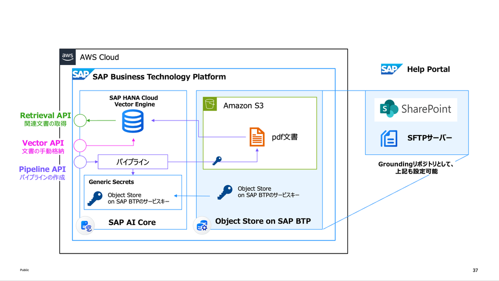
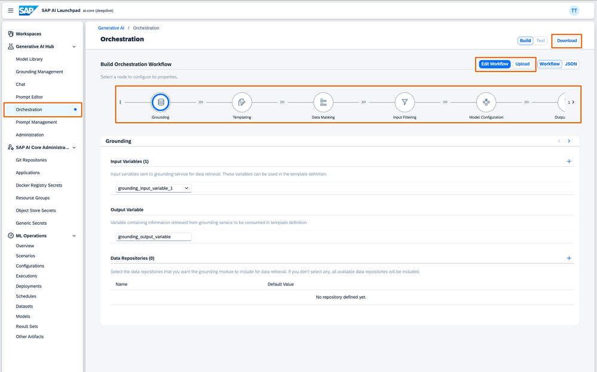
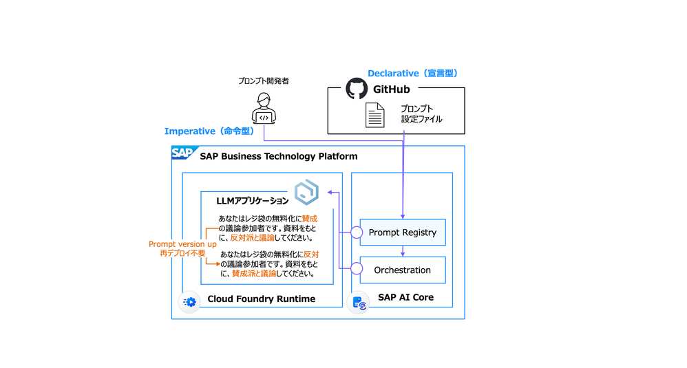
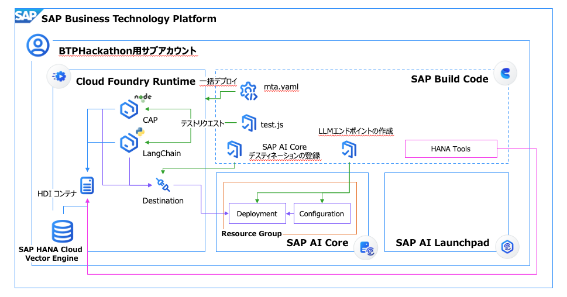

# SAP AI Core サンプルコード

このリポジトリには、SAP AI Coreを使用してAIモデルを管理・実行するためのサンプルコードが含まれています。

## ディレクトリ構成

- `01_grounding/` - ドキュメントグラウンディングのサンプルコード
- `02_orchestration/` - オーケストレーションのサンプルコード
- `03_promptRegistry/` - プロンプトレジストリのサンプルコード
- `04_aiAgentApp/` - AIエージェントアプリケーションのサンプルコード
- `credentials/` - 認証情報ファイル格納ディレクトリ

## 01_grounding
### 概要

### 参考情報
- [SAP AI Core - ドキュメントグラウンディング](https://help.sap.com/docs/sap-ai-core/sap-ai-core-service-guide/document-grounding)
-[SAP AI Core - Generative AI Hubの新機能Groundingを解き明かす](https://community.sap.com/t5/technology-blogs-by-sap/sap-ai-core-generative-ai-hub%E3%81%AE%E6%96%B0%E6%A9%9F%E8%83%BDgrounding%E3%82%92%E8%A7%A3%E3%81%8D%E6%98%8E%E3%81%8B%E3%81%99/ba-p/14065096)

## 02_orchestration
### 概要

### 参考情報
- [SAP AI Core Orchestration機能 を解き明かす](https://community.sap.com/t5/technology-blogs-by-sap/sap-ai-core-orchestration%E6%A9%9F%E8%83%BD-%E3%82%92%E8%A7%A3%E3%81%8D%E6%98%8E%E3%81%8B%E3%81%99/ba-p/14066141)
- [SAP AI Core - オーケストレーション](https://help.sap.com/docs/sap-ai-core/sap-ai-core-service-guide/orchestration)

## 03_promptRegistry
### 概要

### 参考情報
- [SAP AI Core Generative AI Hubのプロンプトレジストリ機能を解き明かす](https://community.sap.com/t5/technology-blogs-by-sap/sap-ai-core-generative-ai-hub%E3%81%AE%E3%83%97%E3%83%AD%E3%83%B3%E3%83%97%E3%83%88%E3%83%AC%E3%82%B8%E3%82%B9%E3%83%88%E3%83%AA%E6%A9%9F%E8%83%BD%E3%82%92%E8%A7%A3%E3%81%8D%E6%98%8E%E3%81%8B%E3%81%99/ba-p/14072026) 
- [SAP AI Core - プロンプトレジストリ](https://help.sap.com/docs/sap-ai-core/sap-ai-core-service-guide/prompt-registry) 

## 04_aiAgentApp
### 概要
SAP HANA Cloud, Vector Engine に追加されたIn-Database Vectorizationと、SAP AI Core - Generative AI HubによるSAPのLLMパートナー企業から提供されるEmbeddingモデルを併用した、LangChainフレームワークによるAI Agentアプリケーションを構築します。

## 05_aiAgentApp_simple
### 概要
SAP HANA Cloud, Vector Engineによるベクトル化の機能を取り除き、`04_aiAgentApp` の簡易版のAIエージェントアプリを構築します。

## 前提条件

- SAP BTP アカウント
- SAP AI Core インスタンス
- Object Store (Amazon S3互換) へのアクセス
- Node.js 環境

## 認証情報の設定

以下の認証情報ファイルを `credentials` ディレクトリに配置する必要があります：

1. `ai_core_sk.json` - SAP AI Coreのサービスキー
2. `object_store_sk.json` - Object Store (S3) のサービスキー
3. `user_defined_variable.json` - ユーザー定義変数（リソースグループIDとシークレット名）

## 実行手順

各ディレクトリのREADME.mdを参照してください。

## 注意事項

- 認証情報ファイル（`credentials/`ディレクトリ内）は適切に保護してください
- 各機能の実行には時間がかかる場合があります
- リソースグループが既に存在する場合は、その旨のメッセージが表示されます

